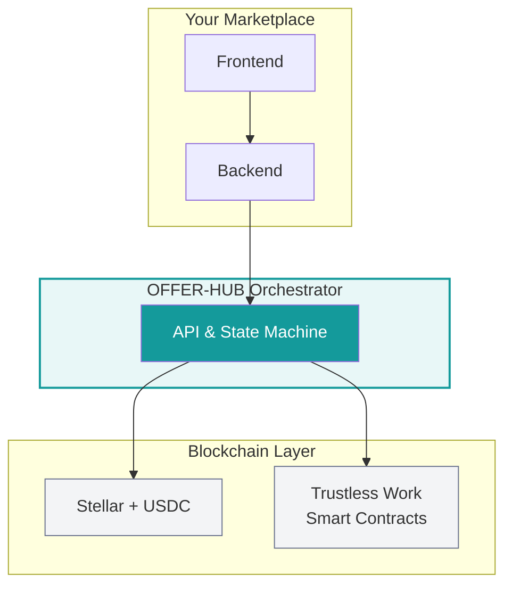

OFFER-HUB Orchestrator is a **self-hosted payments and escrow backend** for service marketplaces. It handles the financial plumbing - escrow, balance management, dispute resolution, and USDC transactions on Stellar - so you can focus on building your marketplace product.

<Callout type="tip">
  Ready to start coding? Jump to [Installation](/docs/installation) for setup instructions, or [Quick Start](/docs/guide/quick-start) for your first API call.
</Callout>

## What Problems It Solves

Building a marketplace with escrow payments from scratch requires solving many complex challenges. The Orchestrator handles them for you:

| Challenge | Orchestrator Solution |
|-----------|----------------------|
| Holding buyer funds securely | Non-custodial escrow via Trustless Work smart contracts |
| Preventing double-spending | Atomic balance operations + idempotency keys |
| Handling "seller didn't deliver" | Built-in dispute workflow with SPLIT resolution |
| Managing crypto wallets for non-crypto users | Invisible Stellar wallets (Web2 UX) |
| Tracking payment state across distributed systems | State machine with full audit log |
| Real-time payment notifications | SSE event stream |

Without the Orchestrator, building all of this could take 6-12 months. With it, you can integrate in a few days.

## How It Works

OFFER-HUB uses a **balance-based ledger** and **smart-contract escrow** to protect every transaction:

### The Payment Flow

1. **Buyer deposits funds** - USDC is detected on-chain and credited to the buyer's available balance
2. **Buyer creates an order** - Funds move from `available` to `reserved` (escrow)
3. **Order goes on-chain** - USDC is locked in a Soroban smart contract via Trustless Work
4. **Work happens** - Your marketplace manages communication, files, deliverables
5. **Buyer approves** - 3 on-chain transactions release USDC to seller
6. **Seller withdraws** - Sends USDC to any Stellar address

At every step, the Orchestrator emits events to your SSE subscriber so you can update your UI in real-time.

## Balance Model

Every user has an internal balance with two components:

| State | Description |
|-------|-------------|
| `available` | Spendable funds - can be withdrawn or used to create orders |
| `reserved` | Locked in active escrow - released on settlement or cancellation |

When an order is funded, `available` decreases and `reserved` increases. When released, `reserved` decreases and the seller's `available` increases.

## Key Features

### Invisible Wallets
Users never see Stellar addresses, seed phrases, or private keys. They see a Web2 balance interface. The Orchestrator manages Stellar keypairs server-side, encrypted with AES-256-GCM.

### Non-Custodial Escrow
Funds in escrow are held in Soroban smart contracts on Stellar, not in your database. The Orchestrator signs transactions but cannot unilaterally move funds - the contracts enforce the rules.

### State Machine Enforcement
Every order follows a strict state machine. Invalid transitions (e.g., releasing before escrow is funded) are rejected. This prevents double-charges, double-releases, and race conditions.

### Idempotent Operations
Every state-changing operation accepts an `Idempotency-Key`. Retrying a failed request with the same key returns the cached response - preventing duplicate orders, escrows, or payments.

### Real-Time Events
Every state change emits a domain event streamed via SSE. Your backend subscribes once and receives real-time updates: "order funded," "funds released," "dispute resolved."

## Payment Providers

Set `PAYMENT_PROVIDER` in your environment to switch:

| Feature | Crypto-Native (default) | AirTM (optional) |
|---------|------------------------|-----------------|
| Deposit method | Send USDC to Stellar address | Fiat payin via AirTM redirect |
| Withdrawal method | Direct USDC to Stellar address | Payout to bank/mobile money |
| Settlement currency | USDC (Stellar) | USD |
| KYC required | No | AirTM KYC |
| Speed | Seconds | Minutes to days |

For most new deployments, **crypto mode is recommended**.

## What the Orchestrator Does NOT Do

| NOT included | Why |
|-------------|-----|
| User authentication | Your marketplace handles auth |
| Product listings | Your marketplace handles this |
| Communication (chat, files) | Your marketplace handles this |
| Tax calculation | Your marketplace or accounting tool |
| Multiple currencies | USDC only (for now) |

The Orchestrator is intentionally narrow: it handles payments, escrow, and balances. Everything else is your marketplace's responsibility.

## Supported Currencies

<Badge variant="primary">USDC</Badge>

USDC on Stellar is the primary supported currency.

## Next Steps

- [Installation](/docs/installation) - Set up the project locally
- [Configuration](/docs/configuration) - Environment variables and setup
- [Quick Start](/docs/guide/quick-start) - Your first API call in 5 minutes
- [API Reference](/docs/api-reference/overview) - Explore the REST API
- [SDK Guide](/docs/sdk/quick-start) - Use the TypeScript SDK
