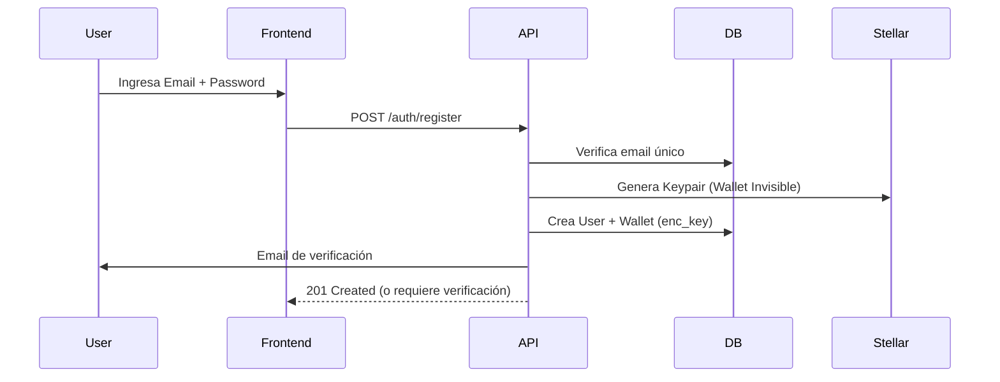
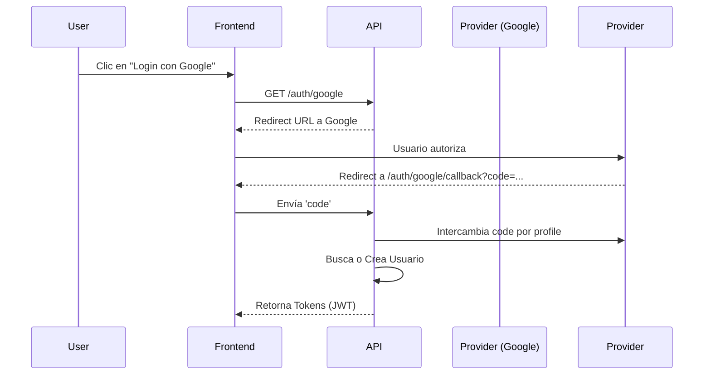

# Sistema de Autenticación Offer Hub

Este documento describe la arquitectura, flujos y especificaciones técnicas del sistema de autenticación de Offer Hub.

## 1. Arquitectura del Sistema

El sistema utiliza una arquitectura híbrida que combina autenticación tradicional (Email/Password), OAuth (Social Login) y tecnologías Web3 (Stellar Wallets).

### 1.1 Componentes Principales

- **Base de Datos (Supabase)**:
  - `users`: Identidad central.
  - `wallets`: Gestión de claves Stellar (custodial/non-custodial).
  - `refresh_tokens`: Gestión de sesiones.
  - `audit_logs`: Registro de seguridad.

- **Backend (Node.js/Express)**:
  - `AuthService`: Lógica principal.
  - `WalletService`: Gestión de claves Stellar.
  - `OAuthService`: Integración con Google, Apple, Microsoft, GitHub.
  - `TokenService`: Manejo de JWT.

- **Frontend (Next.js)**:
  - `AuthProvider`: Contexto global.
  - `WalletProvider`: Conexión con wallets externas.

### 1.2 Estructura de Tokens y Seguridad

El sistema utiliza **JWT (JSON Web Tokens)** para la autenticación stateless.

- **Access Token**:
  - **Formato**: JWT firmado (RS256 o HS256).
  - **Vida útil**: Corta (ej. 15 minutos).
  - **Contenido**: `sub` (user_id), `roles`, `permissions`, `email`.
  - **Almacenamiento**: Memoria (Frontend), Header `Authorization: Bearer <token>`.

- **Refresh Token**:
  - **Formato**: String opaco seguro o JWT.
  - **Vida útil**: Larga (ej. 7 días).
  - **Almacenamiento**: HttpOnly Secure Cookie (recomendado) o LocalStorage (si se requiere acceso desde JS, pero menos seguro).
  - **Rotación**: Cada uso invalida el anterior y emite uno nuevo (Refresh Token Rotation).

- **Seguridad Adicional**:
  - **Rate Limiting**: Protección contra fuerza bruta.
  - **Account Lockout**: Bloqueo tras 5 intentos fallidos.
  - **CSRF**: Protección para endpoints sensibles.

## 2. Flujos de Autenticación

### 2.1 Registro (Email/Password)

### 2.2 Login (Email/Password)
1. Usuario envía credenciales.
2. Backend valida hash de contraseña (bcrypt/argon2).
3. Backend verifica si el email está confirmado.
4. Backend genera Access Token y Refresh Token.
5. Backend actualiza `last_login`.
6. Retorna tokens al cliente.

### 2.3 Login con OAuth (Google/GitHub/etc)

### 2.4 Recuperación de Contraseña
1. **Solicitud**:
   - Usuario ingresa email en `/forgot-password`.
   - Backend genera token temporal (con expiración ej. 1 hora).
   - Backend envía email con link: `https://app.com/reset-password?token=xyz`.
2. **Reset**:
   - Usuario accede al link.
   - Frontend valida token.
   - Usuario ingresa nueva contraseña.
   - Backend actualiza hash y revoca todas las sesiones activas.

## 3. Modelo de Datos (Esquema)

### Tabla `users`
| Campo | Tipo | Descripción |
|-------|------|-------------|
| id | UUID | PK |
| email | VARCHAR | Unique |
| password_hash | VARCHAR | Nullable (si es solo OAuth) |
| email_verified | BOOLEAN | |
| status | ENUM | active, suspended, locked |
| created_at | TIMESTAMP | |

### Tabla `wallets`
| Campo | Tipo | Descripción |
|-------|------|-------------|
| id | UUID | PK |
| user_id | UUID | FK users |
| public_key | VARCHAR | Stellar Address |
| type | ENUM | invisible, external |
| enc_private_key | TEXT | Solo para invisible |
| provider | VARCHAR | 'internal', 'freighter', etc |

### Tabla `refresh_tokens`
| Campo | Tipo | Descripción |
|-------|------|-------------|
| id | UUID | PK |
| user_id | UUID | FK users |
| token_hash | VARCHAR | Hash del token |
| expires_at | TIMESTAMP | |
| revoked | BOOLEAN | |

